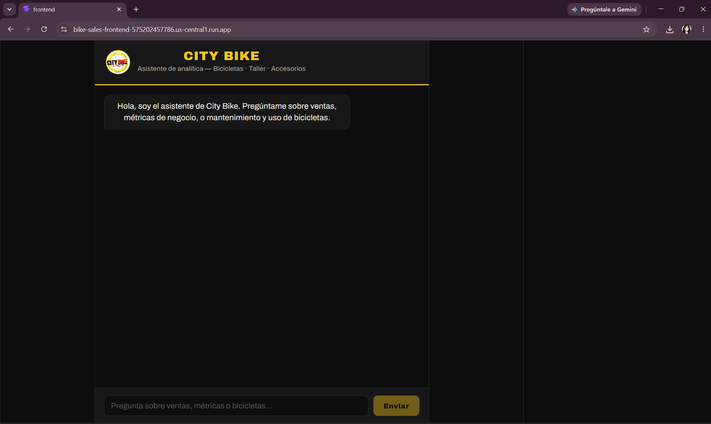
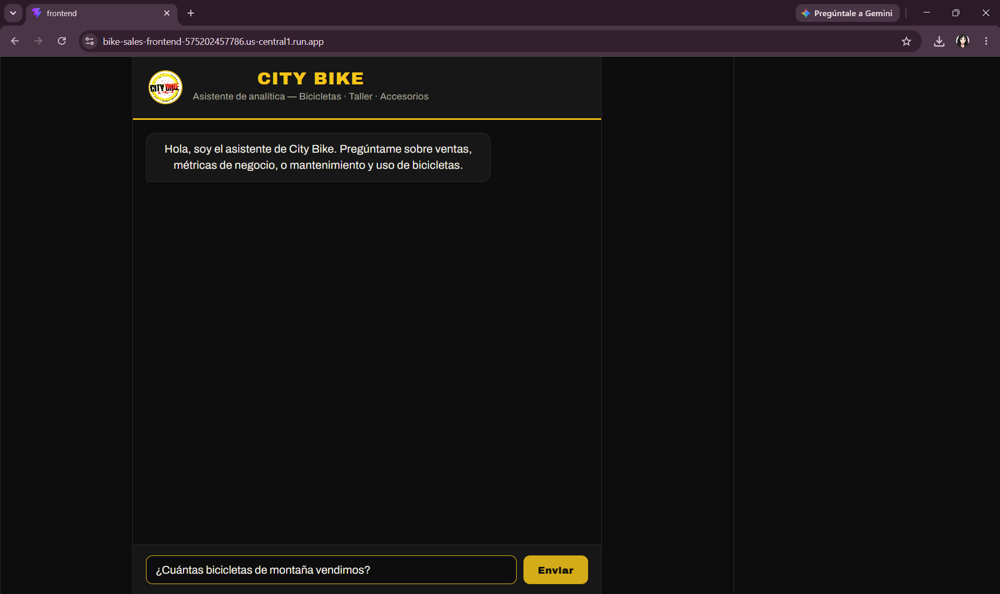
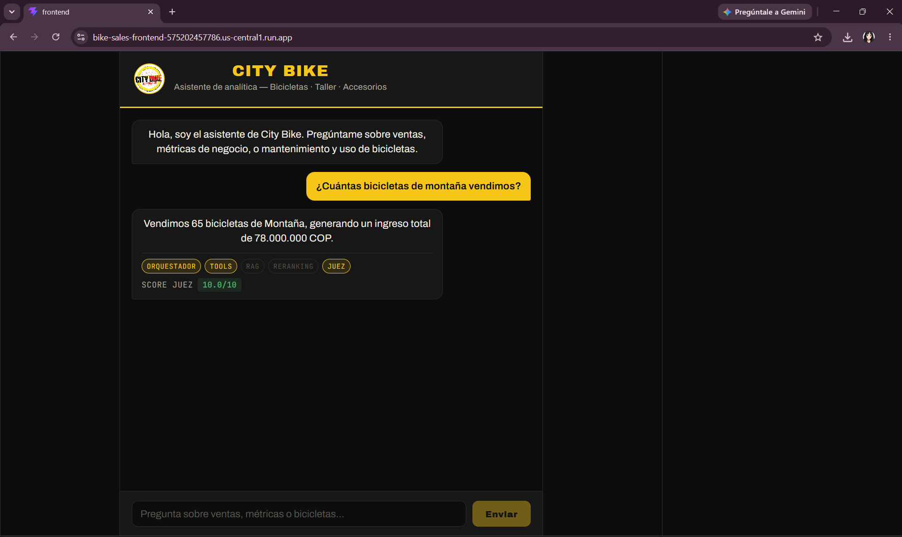
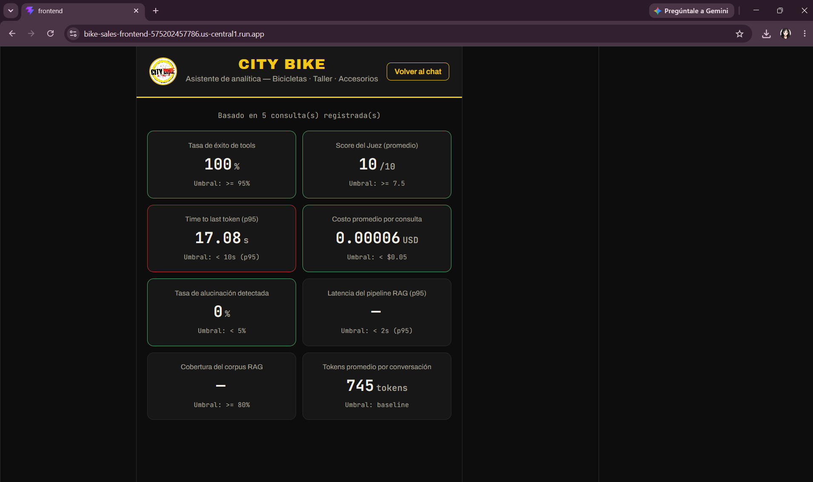

# Guía de Usuario
## Asistente de Analítica City Bike

---

## 1. ¿Qué es esto?

City Bike Asistente es un chat inteligente que responde preguntas sobre las ventas, el negocio, y el mantenimiento de bicicletas — como si le preguntaras a un compañero de trabajo con acceso a todos los datos de la tienda y a los manuales de los fabricantes.

No necesitas saber nada técnico para usarlo: escribes tu pregunta en español, como lo harías en WhatsApp, y el asistente responde con la información real.

**Puedes usarlo en:** `https://bike-sales-frontend-575202457786.us-central1.run.app`

---

## 2. Cómo usarlo, paso a paso

**Paso 1 — Abre el link.** Te va a aparecer una pantalla oscura con el logo de City Bike arriba, y un mensaje de bienvenida.

**Paso 2 — Escribe tu pregunta.** En la caja de texto de abajo, escribe lo que quieras saber. Por ejemplo: *"¿Cuántas bicicletas de montaña vendimos?"*

**Paso 3 — Dale clic en "Enviar" (o presiona Enter).** El asistente va a mostrar "Procesando..." mientras piensa la respuesta — normalmente tarda entre 3 y 12 segundos.

**Paso 4 — Lee la respuesta.** Va a aparecer en una burbuja, junto con unas etiquetas pequeñas debajo que muestran **qué partes del sistema se usaron** para responder (por ejemplo: "Orquestador", "Tools", "Juez") y una nota de calidad ("Score Juez").

**Paso 5 (opcional) — Ver el panel de métricas.** Arriba a la derecha hay un botón **"Ver dashboard"** — te muestra estadísticas de uso del sistema (qué tan rápido responde, qué tan seguido acierta, etc.).

---

## 3. Ejemplos de preguntas que el sistema maneja bien

- *"¿Cuántas bicicletas de montaña vendimos en total?"* — consulta datos reales de ventas.
- *"¿Cuál es el margen bruto si tuve 1.000.000 en ingresos y 650.000 en costos?"* — hace el cálculo exacto.
- *"¿Cómo se revisan los frenos antes de cada paseo?"* — busca en los manuales reales de bicicletas.
- *"Dame un reporte de ventas de la categoría Urbana."* — genera un resumen completo con cifras y margen.

---

## 4. ¿Qué pasa si preguntas algo fuera del alcance del sistema?

El asistente **no inventa información**. Si le preguntas algo que no está en sus documentos ni en sus datos de ventas (por ejemplo, una pregunta sobre otra marca de bicicletas que no está en el manual, o un tema completamente ajeno al negocio), va a responder honestamente que no tiene esa información, en vez de inventar una respuesta que suene convincente pero sea falsa.

Esto es intencional: el sistema tiene un "revisor de calidad" interno (el Agente Juez) que detecta y rechaza respuestas con datos inventados antes de que lleguen a ti.

---

## 5. Cómo interpretar el panel de métricas (dashboard)

| Indicador | Qué significa en simple |
|---|---|
| Tasa de éxito de tools | De cada 100 veces que el sistema usó una herramienta (calculadora, consulta de ventas), cuántas veces funcionó sin errores. |
| Score del Juez (promedio) | Qué tan buena, en promedio, considera el propio sistema que fueron sus respuestas (0 a 10). |
| Time to last token | Cuánto tarda, en promedio, en darte una respuesta completa. |
| Costo promedio por consulta | Cuánto cuesta, en dólares, cada pregunta que le haces (para control de gastos del negocio). |
| Tasa de alucinación | Qué tan seguido el sistema intentó dar información inventada (idealmente, cerca de 0%). |
| Latencia del pipeline RAG | Cuánto tarda específicamente la parte de "buscar en los documentos". |
| Cobertura del corpus RAG | Qué tan seguido, al buscar en los documentos, sí encuentra información realmente relevante. |
| Tokens promedio por conversación | Una medida técnica de "cuánto texto" procesa el sistema por conversación, en promedio. |

Cada tarjeta se pinta en **verde** si el sistema está cumpliendo su meta de calidad, o en **rojo** si no — así, con solo mirar colores, sabes si algo necesita atención.

---

## 6. Limitaciones conocidas del sistema

- El corpus de documentos es pequeño (4 documentos) — preguntas muy específicas fuera de esos temas no van a tener buena respuesta.
- Los datos de ventas son de ejemplo (sintéticos, no las cifras reales del negocio) — se documentó así intencionalmente para no exponer información comercial real en un repositorio público.
- El sistema no tiene memoria entre preguntas — cada pregunta se responde de forma independiente, no recuerda lo que hablaron antes en la misma sesión.
- **El Orquestador ejecuta como máximo una tool por consulta.** Preguntas que combinan varios temas distintos a la vez (por ejemplo, pedir ventas + un cálculo + información de mantenimiento en una sola pregunta larga) pueden resultar en que el modelo "prometa" cubrir todo en el texto pero solo llegue a resolver una parte — el Agente Juez detecta esto (score bajo) e intenta un refinamiento, pero si tras ese único reintento la respuesta sigue sin superar el umbral, se envía de todas formas. *Hallazgo confirmado durante pruebas de QA manuales antes de la entrega.* Recomendación de uso: hacer una pregunta a la vez, en vez de preguntas compuestas.
- **El comportamiento multilingüe no es 100% consistente entre idiomas.** El sistema responde correctamente en español e inglés (probado). En alemán, se observó una respuesta híbrida (estructura de la oración en español, con un término técnico dejado sin traducir) — el dato en sí seguía siendo correcto, pero la redacción no fue completamente coherente en un solo idioma. *Hallazgo de QA; no se implementó una corrección específica dado el alcance del proyecto.*
- No hay un mecanismo automático de reintento si el servicio de inteligencia artificial de Google (Vertex AI) llega a fallar momentáneamente — en ese caso, el asistente mostrará un mensaje de error y habría que intentar la pregunta de nuevo.
- La app se probó en computador y en celular (Chrome, Brave); no se probó exhaustivamente en todos los navegadores del mercado.
